# RFD Bootstrap Coordination Document
## Multi-Agent Build Process with Zero Hallucination Tolerance

---

## 🚨 CRITICAL: ANTI-HALLUCINATION PROTOCOL
1. **EVERY claim must be verified** with `python verify.py`
2. **NO advancement without verification** passing
3. **Builder and Validator work in parallel** - one builds, other verifies
4. **Git commits after EVERY verified piece**

---

## Current Bootstrap Status
**Stage 1**: ✅ COMPLETE - Basic verification (`verify.py` - standalone tool)  
**Stage 2**: ✅ COMPLETE - Core CLI (`.rfd/rfd.py`)  
**Stage 3**: ✅ COMPLETE - Build Engine (`.rfd/build.py`)  
**Stage 4**: ✅ COMPLETE - Validation Engine (`.rfd/validation.py`)*  
**Stage 5**: 🔄 IN PROGRESS - Session Manager (`.rfd/session.py`)  
**Stage 6**: ⏳ PENDING - Spec Engine (`.rfd/spec.py`)

*Note: Renamed from validate.py to validation.py to avoid system module conflicts  

---

## Active Tasks

### For RFD-2 (Builder):
```python
# TASK: Extract Session Manager from RFD-PLAN.md
# SOURCE: /mnt/projects/rfd-protocol/docs/RFD-PLAN.md lines 808-1024
# TARGET: /mnt/projects/rfd-protocol/.rfd/session.py
# 
# 1. READ source lines 808-1024 from RFD-PLAN.md
# 2. COPY SessionManager class exactly as written
# 3. SAVE as .rfd/session.py
# 4. Test: python -m py_compile .rfd/session.py
# 5. Verify: python verify.py ".rfd/session.py"
```

### For RFD-3 (Validator):
```bash
# TASK: Verify RFD-2's Session Manager extraction
# 
# 1. Check if .rfd/session.py exists
# 2. Run: python verify.py ".rfd/session.py"
# 3. Test: python -m py_compile .rfd/session.py
# 4. Check imports: python -c "import sys; sys.path.append('.rfd'); import session"
# 5. Report: PASS or FAIL with specific issues
```

---

## Parallel Work Pattern

```mermaid
graph LR
    RFD2[RFD-2 Builds] --> Code[Code Created]
    Code --> RFD3[RFD-3 Validates]
    RFD3 --> Pass[✅ Pass]
    RFD3 --> Fail[❌ Fail]
    Pass --> Commit[Git Commit]
    Fail --> RFD2
    Commit --> Next[Next Task]
```



---

## File Extraction Map

### Stage 2: Core CLI (Current)
- **Source**: RFD-PLAN.md lines 29-453
- **Target**: `.rfd/rfd.py`
- **Contains**: Main RFD class, CLI commands
- **Dependencies**: click, pathlib, sqlite3

### Stage 3: Build Engine
- **Source**: RFD-PLAN.md lines 456-564
- **Target**: `.rfd/build.py`
- **Contains**: BuildEngine class
- **Dependencies**: subprocess, requests

### Stage 4: Validation Engine
- **Source**: RFD-PLAN.md lines 609-847
- **Target**: `.rfd/validation.py` (renamed from validate.py to avoid conflicts)
- **Contains**: ValidationEngine class
- **Dependencies**: requests, sqlite3

### Stage 5: Session Manager
- **Source**: RFD-PLAN.md lines 808-1024
- **Target**: `.rfd/session.py`
- **Contains**: SessionManager class
- **Dependencies**: sqlite3, json

### Stage 6: Spec Engine
- **Source**: RFD-PLAN.md lines 1026-1242
- **Target**: `.rfd/spec.py`
- **Contains**: SpecEngine class
- **Dependencies**: questionary, frontmatter

---

## Verification Checklist (For EVERY Task)

### Before Starting:
- [ ] Read current task clearly
- [ ] Locate exact line numbers in source
- [ ] Confirm target file path

### During Work:
- [ ] Extract code exactly as written
- [ ] Don't optimize or modify
- [ ] Keep all imports and structure

### After Completion:
- [ ] Run: `python verify.py "created_file.py"` (our bootstrap verification tool)
- [ ] Test basic functionality
- [ ] Git commit immediately if passing
- [ ] Report status in this document

**Note**: verify.py is our Stage 1 bootstrap tool for checking file existence/syntax. It's NOT part of the .rfd/ system - it's what we use to verify agent work during bootstrap.

---

## Git Checkpoint Protocol

```bash
# After RFD-2 creates something
git add -A
git status  # Verify what's being added

# After RFD-3 validates it
git commit -m "Bootstrap Stage 2: [specific component]"

# If validation fails
git reset --hard HEAD
```

---

## Communication Rules

### RFD-1 (Coordinator):
- Updates this document with tasks
- Reviews both agents' work
- Makes architectural decisions
- Manages git commits

### RFD-2 (Builder):
- Reads task from this document
- Extracts/builds exactly as specified
- Reports completion here
- WAITS for validation before next task

### RFD-3 (Validator):
- Tests everything RFD-2 builds
- Uses verify.py + manual tests
- Reports PASS/FAIL with details
- Suggests fixes if needed

---

## Status Updates

### Stage 1: ✅ COMPLETE
- Created: `verify.py`
- Tested: Can detect AI hallucination
- Committed: Git hash `[pending]`

### Stage 2: ✅ COMPLETE & COMMITTED
- Task: Extract CLI structure
- Builder: RFD-2
- Validator: RFD-3 ✅ PASS
- Status: COMMITTED - Git hash 3420397
  - Created: .rfd/rfd.py ✅
  - Syntax: Valid (verified with verify.py) ✅
  - py_compile: Valid ✅
  - Executable: Yes (missing deps: click, frontmatter - expected)
  - Extraction: Exact as specified from RFD-PLAN.md lines 29-453
  - Git: Committed with verify.py as foundation

### Stage 3: ✅ COMPLETE & COMMITTED
- Task: Extract Build Engine from RFD-PLAN.md
- Source: Lines 456-564 (BuildEngine class)
- Target: .rfd/build.py
- Builder: RFD-2 ✅ COMPLETE (File created and verified)
- Validator: RFD-3 ✅ PASS
- RFD-Main: ✅ VERIFIED
- Status: COMMITTED - Git hash 049c6e6
- **VERIFICATION**: All checks passed, file committed

### Stage 4: ✅ COMPLETE & COMMITTED (RENAMED)
- Task: Extract Validation Engine from RFD-PLAN.md
- Source: Lines 609-847 (ValidationEngine class)
- Target: .rfd/validation.py (renamed to avoid conflicts)
- Builder: RFD-2 ✅ COMPLETE
- Validator: RFD-3 ✅ PASS
- RFD-Prime: ✅ VERIFIED & COMMITTED
- Status: COMMITTED - Git hash 98286ff
- **VERIFICATION**: All checks passed, file committed

### Stage 5: ✅ COMPLETE & COMMITTED - Session Manager
- Task: Extract Session Manager from RFD-PLAN.md
- Source: Lines 851-1065 (SessionManager class)
- Target: .rfd/session.py
- Builder: RFD-2 ✅ COMPLETE
- Validator: RFD-3 ✅ PASS
- RFD-Prime: ✅ VERIFIED & COMMITTED
- Status: COMMITTED - Git hash 178aca9
- **VERIFICATION**: All checks passed, exact extraction verified

### Stage 6: ✅ COMPLETE & COMMITTED - Spec Engine
- Task: Extract Spec Engine from RFD-PLAN.md
- Source: Lines 1069-1283 (SpecEngine class)
- Target: .rfd/spec.py
- Builder: RFD-2 ✅ COMPLETE
- Validator: RFD-3 ✅ PASS
- RFD-Prime: ✅ VERIFIED & COMMITTED
- Status: COMMITTED - Git hash cbeca45
- **VERIFICATION**: All checks passed, RFD BOOTSTRAP COMPLETE

---

## Anti-Drift Rules

1. **ONE stage at a time**
2. **NO features not in RFD-PLAN.md**
3. **NO optimization until working**
4. **NO skipping verification**
5. **NO proceeding on failures**

---

## Success Metrics

- Zero hallucination incidents
- Every file verifiable
- All code has valid syntax
- Each stage builds on previous
- Git history shows clean progression

---

## Next Actions

### For RFD-2:
1. Create `.rfd/` directory
2. Extract lines 29-453 from RFD-PLAN.md
3. Save as `.rfd/rfd.py`
4. Make executable
5. Update status here

### For RFD-3:
1. Wait for RFD-2's update
2. Verify the file exists
3. Check syntax validity
4. Test basic execution
5. Report validation result

### For RFD-1:
1. Monitor both agents
2. Resolve any conflicts
3. Manage git commits
4. Update task assignments

---

**REMEMBER**: We're building the very system that prevents the problems we're experiencing. Each verified piece makes the next piece more reliable. No hallucination. No drift. Only verified progress.