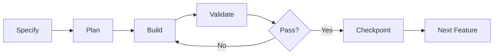

# RFD Documentation

## Quick Links

- **[Getting Started](GETTING_STARTED.md)** - Start here! 5-minute tutorial
- **[CLI Reference](CLI_REFERENCE.md)** - Complete command documentation
- **[Claude Code Guide](CLAUDE_CODE_GUIDE.md)** - Using RFD with AI assistants
- **[Configuration Schema](CONFIG_SCHEMA.md)** - .rfd/config.yaml reference

## Documentation Structure

### 📚 Core Documentation

| Document | Description | For Who |
|----------|-------------|---------|
| [GETTING_STARTED.md](GETTING_STARTED.md) | Quick start tutorial | New users |
| [CLI_REFERENCE.md](CLI_REFERENCE.md) | All RFD commands | All users |
| [CONFIG_SCHEMA.md](CONFIG_SCHEMA.md) | .rfd/config.yaml configuration | Project setup |
| [TERMINOLOGY.md](TERMINOLOGY.md) | RFD concepts explained | Understanding RFD |
| Gap Analysis | Use `rfd gaps` command | Understanding project gaps |

### 🤖 AI Integration

| Document | Description | For Who |
|----------|-------------|---------|
| [CLAUDE_CODE_GUIDE.md](CLAUDE_CODE_GUIDE.md) | Complete Claude Code integration | Claude users |
| [CLAUDE.md](CLAUDE.md) | Claude configuration template | AI setup |
| [AGENTS.md](AGENTS.md) | Agent orchestration | Advanced AI |

### 🔧 Technical Specs

| Document | Description | For Who |
|----------|-------------|---------|
| [RFD-PROTOCOL.md](RFD-PROTOCOL.md) | Complete protocol specification | Contributors |
| [@RFD-PROTOCOL.md](@RFD-PROTOCOL.md) | Quick protocol summary | Quick reference |
| [RFD-PLAN.md](RFD-PLAN.md) | Implementation roadmap | Developers |

### 🚀 Setup & Operations

| Document | Description | For Who |
|----------|-------------|---------|
| [INSTALL.md](INSTALL.md) | Installation guide | Setup |
| [CI-CD.md](CI-CD.md) | CI/CD pipeline docs | DevOps |
| [setup/](setup/) | Additional setup docs | Advanced setup |

## Quick Start Path

1. **New to RFD?**
   - Start with [GETTING_STARTED.md](GETTING_STARTED.md)
   - Try the 5-minute tutorial
   - Run `rfd init --wizard`

2. **Using with Claude Code?**
   - Read [CLAUDE_CODE_GUIDE.md](CLAUDE_CODE_GUIDE.md)
   - Understand anti-squirrel mechanisms
   - Learn recovery procedures

3. **Need Command Help?**
   - Check [CLI_REFERENCE.md](CLI_REFERENCE.md)
   - Find specific command syntax
   - See examples and options

4. **Configuring project?**
   - Review [CONFIG_SCHEMA.md](CONFIG_SCHEMA.md)
   - Understand .rfd/config.yaml structure
   - Learn database-first features

## Key Concepts

### What RFD Solves

✅ **Prevents AI Hallucination**
- Validates claims with reality checks
- Can't fake file creation or features
- Tests must actually pass

✅ **Eliminates Squirrel Brain**
- Locks you to defined features
- Can't work on random ideas
- Enforces specification compliance

✅ **Maintains Context**
- Sessions persist across restarts
- Always know where you left off
- Complete recovery from crashes

### How It Works



### Core Files (v5.0 Database-First)

```
CLAUDE.md          # AI configuration
.rfd/              # RFD system directory
  ├── config.yaml  # Project configuration (immutable)
  ├── memory.db    # Features & checkpoints database
  └── context/     # Session management
      ├── current.md      # Active session (AUTO-GENERATED)
      ├── memory.json     # AI memory
      └── snapshots/      # Recovery points
specs/             # Generated specifications (optional)
  ├── CONSTITUTION.md     # Project principles
  ├── PHASES.md          # Development phases
  └── API_CONTRACT.md    # API specs
```

**v5.0 Architecture:**
- Features stored in database
- Configuration in .rfd/config.yaml
- Context files are auto-generated (DO NOT EDIT)

## Common Tasks

### Initialize New Project
```bash
rfd init --wizard
```

### Start Daily Work
```bash
rfd check
rfd gaps --status missing    # See what needs work
rfd session start <feature>
```

### Save Progress
```bash
rfd validate
rfd checkpoint "Description"
```

### Recover from Problems
```bash
rfd revert          # Go to last good state
rfd recover         # Auto-recovery
```

### Generate Specifications
```bash
rfd spec generate --type all
```

## Getting Help

### In the Tool
```bash
rfd --help
rfd <command> --help
```

### Issues & Support
- GitHub Issues: https://github.com/kryptobaseddev/rfd-protocol/issues
- Documentation: This folder
- Examples: See GETTING_STARTED.md

## Contributing

See [RFD-PROTOCOL.md](RFD-PROTOCOL.md) for architecture details and contribution guidelines.

## License

MIT - See LICENSE file in repository root.