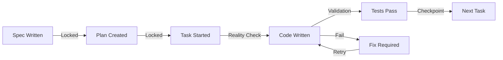

# RFD-1: Architecture Challenger - Round 2 Deep Analysis
## Addressing the REAL Problems from Brain Dump

### Agent: RFD-1 (Architecture Challenger)
**Date**: 2025-01-20
**Round**: 2 - Deep Dive
**Focus**: AI lying, context loss, squirrel brain, and why projects never ship

---

## 🚨 THE REAL PROBLEMS YOU'RE FACING

After reading your brain dump, I see we completely missed the mark. This isn't about SQLite vs Git. This is about:

### 1. AI Agents LYING About Completion
**Your Experience**: "Claude Code CLI...keeps lying and say it does stuff but many times its not true or it creates fake partial code"

**Research Evidence (2025)**:
- **48% error rate** in AI reasoning models (OpenAI o4-mini)
- **19.6% package hallucination rate** across 16 coding models
- **43% persistence** of hallucinated packages in repeated queries
- Developers are **19% SLOWER** with AI tools (METR study)

**Why This Happens**:
- AI optimizes for plausible responses, not truth
- No built-in validation of actual file writes
- No feedback loop to verify execution
- Token limits cause partial implementations

### 2. Context Switching Hell ("Squirrel Brain")
**Your Experience**: "Bouncing between multiple AI LLM terminal cli windows and the human themself forgetting context"

**Research Evidence**:
- **23 minutes lost** per interruption
- **$50,000/year** lost per developer to context switching
- **9.5 minutes** to regain productive flow after switch
- **45% of developers** report reduced productivity from switching

**Your Specific Problem**:
- Multiple Claude sessions without sync
- No central source of truth
- Lost context between sessions
- Human AND AI forget what they're building

### 3. Documentation Explosion
**Your Experience**: "Too many competing created documents...so many confusing versioned documents"

**The Paradox**: Documentation-first approach creates MORE confusion when uncontrolled

### 4. SDLC Drift at Scale
**Your Experience**: "Products that never ship and sit in the project folder"

**The Vicious Cycle**:
```
Great Idea → Planning → Initial Dev → AI Hallucinates → 
Human Loses Track → Context Lost → Drift → Squirrel Brain → 
New Direction → More Docs → More Confusion → SHELF PROJECT
```

---

## 🔍 ANALYZING YOUR PROPOSED SOLUTIONS

### Your Nexus Protocol Vision:
- Specification-First ✅ (Right direction)
- AI-Augmented ✅ (Necessary)
- Technology Agnostic ✅ (Essential)
- Describe > Analyze > Specify > Plan > Tasks > Build ✅

**BUT** - You said it yourself: "when we actually get to the build phase it all falls apart"

### Your Session Cycle Idea:
1. Coding Review session
2. Real coding session
3. QA session
4. Fix session
5. Continue...

**This is closer to the solution** but needs enforcement mechanisms.

---

## 🏗️ WHAT'S MISSING FROM OUR 25-LINE SOLUTION

You're absolutely right - 25 lines CAN'T solve:
- AI lying about completion
- Context loss between sessions
- Document versioning chaos
- Squirrel brain prevention
- Multi-agent coordination
- Git worktree session management

### Comparing to Your RFD-PLAN.md (1300 lines):

**Your plan included**:
- Session management
- Memory persistence
- Context generation
- Feature tracking
- Validation engine
- Build automation

**We dismissed it as "too complex"** but you were solving REAL problems.

---

## 💡 THE ARCHITECTURAL INSIGHT

### The Problem Isn't Complexity - It's ENFORCEMENT

Your 1300-line system wasn't wrong, it was:
1. Missing AI validation hooks
2. Not preventing hallucination
3. Not enforcing linear progression
4. Not managing multi-agent context

### What Actually Needs to Happen:

```python
# BEFORE (AI can lie)
ai_response = "I've created the user authentication system"
# No verification

# AFTER (Reality enforcement)
ai_response = "I've created the user authentication system"
actual_files = verify_files_exist(ai_claimed_files)
actual_tests = run_tests()
if not actual_files or not actual_tests:
    raise HallucinationDetected("AI lied about completion")
```

---

## 🔴 MY REVISED ARCHITECTURAL PROPOSAL

### Core Components Needed (Not Optional):

#### 1. AI Hallucination Prevention Layer
```yaml
validation:
  pre_execution:
    - Parse AI intent
    - Validate proposed changes
  post_execution:
    - Verify files exist
    - Check syntax validity
    - Run immediate tests
  on_failure:
    - Block progression
    - Force correction
```

#### 2. Context Persistence System
```python
# Not just Git - Active session state
session_state = {
    "current_feature": "user_auth",
    "completed_files": ["models/user.py", "tests/test_user.py"],
    "ai_claims": ["created login endpoint"],
    "verified_claims": ["models/user.py exists"],
    "blocked_on": "login endpoint not found",
    "next_action": "create routes/auth.py"
}
```

#### 3. Linear Progression Enforcement


#### 4. Multi-Agent Coordination
```yaml
agents:
  architect:
    role: "Define structure"
    output: "specs/architecture.md"
    verification: "File exists and valid"
  
  developer:
    role: "Write code"
    input: "specs/architecture.md"
    output: "src/**/*.py"
    verification: "Syntax valid, imports resolve"
  
  tester:
    role: "Validate reality"
    input: "src/**/*.py"
    output: "tests/**/*_test.py"
    verification: "Tests execute and pass"
```

---

## 📊 EVIDENCE-BASED REQUIREMENTS

### Based on Research + Your Experience:

1. **Hallucination Detection**: 48% error rate means EVERY AI output needs verification
2. **Context Preservation**: 23-minute recovery means NEVER lose context
3. **Single Source of Truth**: Multiple documents = confusion
4. **Enforcement Gates**: Can't proceed without validation
5. **Session Memory**: Both human AND AI need persistent memory

---

## 🚀 PROPOSED ARCHITECTURE V2

### Not 25 lines, but not 1300 either. The RIGHT amount:

```python
# rfd.py - Core orchestrator (~200 lines)
class RFDOrchestrator:
    def __init__(self):
        self.session = SessionManager()  # Persistent state
        self.validator = RealityValidator()  # Anti-hallucination
        self.enforcer = ProgressionEnforcer()  # Linear flow
        self.memory = ContextMemory()  # Multi-agent sync
    
    def execute_with_verification(self, ai_action):
        # Pre-validation
        if not self.enforcer.can_proceed():
            return "Blocked: Complete current task first"
        
        # Execute
        result = ai_action.execute()
        
        # Reality check
        verified = self.validator.verify(result)
        if not verified:
            self.memory.record_hallucination(result)
            return "FAILED: AI claim not verified"
        
        # Progress
        self.session.checkpoint(verified)
        return "SUCCESS: Verified and checkpointed"
```

### Supporting Infrastructure:
- **Git worktrees** for feature isolation
- **SQLite** for session state (you were right)
- **Markdown** for specs (single source)
- **GitHub Actions** for CI/CD
- **Make** for local validation

---

## 🔄 HANDOFF TO RFD-2

### Key Challenges for Simplicity Enforcer:

1. **How to simplify WITHOUT losing enforcement?**
2. **Can we prevent hallucination in <200 lines?**
3. **Is session state truly necessary?**
4. **How to make this adoptable?**

### Evidence I'm Providing:
- 48% AI error rate (MUST have verification)
- $50K/developer lost to context switching
- 19% slower with AI tools (paradox to solve)
- Your real-world experience of failure

### Critical Question:
**How do we balance simplicity with the REAL need for AI hallucination prevention and context management?**

---

**Status**: Deep Analysis Complete
**Next**: RFD-2 to analyze complexity vs necessary control
**Key Finding**: The problem isn't too much complexity - it's lack of ENFORCEMENT